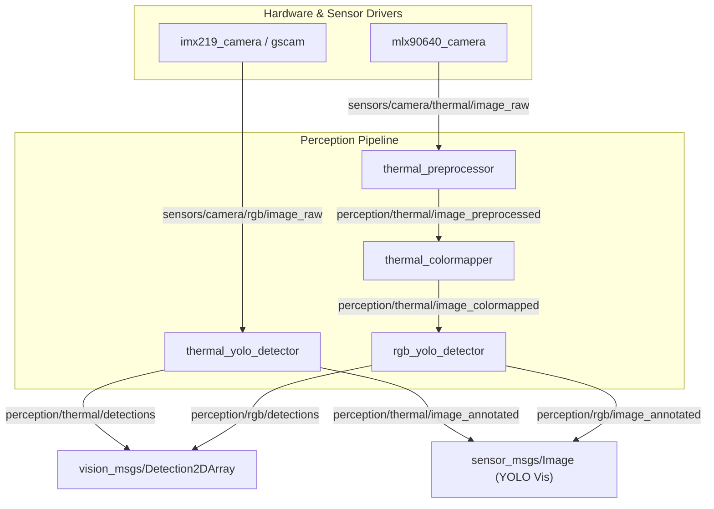

# Divitor ROS 2 Workspace

This workspace contains the driver, perception, and bringup packages for the **Divitor** project—an aerial target detection system utilizing a Raspberry Pi. It integrates both thermal sensing (via the MLX90640 sensor) and RGB vision (via an IMX219 camera) to execute real-time human detection and streaming.

---

## Workspace Structure

The workspace contains the following core ROS 2 packages under `src/`:

```
src/
├── divitor_bringup/      # Python package for launching and configuring nodes
├── divitor_driver/       # C++ package for camera and thermal sensor drivers
├── divitor_perception/   # C++ package for preprocessors 
├── divitor_perception_py/ # Python perception nodes, including the Ultralytics YOLO detector
└── ros-gst-bridge/       # Submodule providing ROS 2 <-> GStreamer bridge elements
```

---

## Architecture & Data Flow

Below is the node data flow and topic layout when running the full system. Composable container launches can optimize this flow using zero-copy intra-process communication.



---

## Prerequisites & Dependencies

### System Requirements
* **OS**: Linux (typically Ubuntu 22.04 LTS for ROS 2 Humble)
* **ROS 2 Distro**: Humble Hawksbill

### Hardware Requirements
* **Processor**: Raspberry Pi 4 / 5 or equivalent board
* **Cameras**: 
  * Raspberry Pi Camera Module V2 (IMX219)
  * MLX90640 Thermal Sensor connected via I2C (`/dev/i2c-1`)

### Dependencies
Ensure the following packages and libraries are installed:
```bash
sudo apt update && sudo apt install -y \
  gstreamer1.0-plugins-bad \
  gstreamer1.0-plugins-base \
  gstreamer1.0-plugins-good \
  gstreamer1.0-plugins-ugly \
  gstreamer1.0-tools \
  libopencv-dev \
  ros-humble-cv-bridge \
  ros-humble-vision-msgs \
  ros-humble-sensor-msgs \
  ros-humble-gscam \
  python3-pip
```

Install the Python YOLO inference dependency for `divitor_perception_py`:
```bash
python3 -m pip install ultralytics
```

---

## Installation & Compilation

1. **Clone the repository and submodules**:
   ```bash
   git clone --recursive <repository-url>
   cd ros2_ws
   ```
2. **Build the workspace**:
   Use `colcon build` to compile all packages:
   ```bash
   colcon build --symlink-install --cmake-args -DCMAKE_BUILD_TYPE=Release
   ```
3. **Source the setup script**:
   ```bash
   source install/setup.bash
   ```

---

## Packages & Nodes Detail

### 1. `divitor_driver`

Handles communication with physical sensors.

* **`mlx90640_camera`**:
  * Reads the 32x24 raw thermal matrix from the MLX90640 sensor over I2C.
  * **Published Topics**:
    * `sensors/camera/thermal/image_raw` (`sensor_msgs/msg/Image` in `32FC1` format)
  * **Parameters**:
    * `i2c_address` (default: `0x33`): I2C address of the thermal camera.
    * `power_of_2_refresh_rate` (default: `5` -> $2^5 = 32\text{ Hz}$): Configures refresh rate of the sensor.

* **`imx219_camera_node`** (Optional wrapper; `gscam` is typically used instead):
  * Captures frames via GStreamer `libcamerasrc` and publishes as ROS Images.
  * **Published Topics**:
    * `sensors/camera/rgb/image_raw` (`sensor_msgs/msg/Image`)

---

### 2. `divitor_perception`

Processes camera frames and performs target extraction.

* **`thermal_preprocessor`**:
  * Performs dead/bad pixel correction at native sensor resolution, applies temporal Exponential Moving Average (EMA) filtering, upscales the frame using Bicubic interpolation, and applies Gaussian Blur.
  * **Subscribed Topics**:
    * `sensors/camera/thermal/image_raw` (`sensor_msgs/msg/Image` in `32FC1` format)
  * **Published Topics**:
    * `perception/thermal/image_preprocessed` (`sensor_msgs/msg/Image` in `32FC1` format)
  * **Parameters**:
    * `target_width` (default: `128`): Spatial upscaling target width.
    * `target_height` (default: `96`): Spatial upscaling target height.
    * `gaussian_kernel_size` (default: `5`): Kernel size for spatial Gaussian Blur (must be odd, e.g. 3, 5).
    * `gaussian_sigma` (default: `1.0`): Standard deviation for Gaussian Blur.
    * `enable_temporal_filter` (default: `true`): Toggle temporal noise EMA filtering.
    * `ema_alpha` (default: `0.6`): Alpha constant for temporal Exponential Moving Average smoothing.
    * `enable_bad_pixel_correction` (default: `true`): Toggle adaptive dead/bad pixel detection and replacement.
    * `bad_pixel_threshold` (default: `3.0`): Standard deviation multiplier to define a pixel as "bad" relative to the local neighborhood median.
    * `bad_pixel_neighborhood` (default: `3`): Neighborhood kernel size (odd integer, e.g., 3 or 5) for computing the local median via `cv::medianBlur`.

* **`thermal_colormapper_node`**:
  * Converts the preprocessed thermal temperature image into a BGR8 color-mapped image for visualization.
  * **Subscribed Topics**:
    * `perception/thermal/image_preprocessed` (`sensor_msgs/msg/Image` in `32FC1` format)
  * **Published Topics**:
    * `perception/thermal/image_colormapped` (`sensor_msgs/msg/Image` in `bgr8` format)
  * **Parameters**:
    * `min_temp` (default: `5.0`): Lower temperature bound used for normalization.
    * `max_temp` (default: `45.0`): Upper temperature bound used for normalization.

---

### 3. `divitor_perception_py`

Provides Python-based perception nodes using `rclpy`, OpenCV, and Ultralytics.

* **`yolo_detector`**:
  * Runs YOLO object detection on incoming RGB images.
  * **Subscribed Topics**:
    * `image_raw` (`sensor_msgs/msg/Image`): Input image converted to BGR for inference.
  * **Published Topics**:
    * `detections` (`vision_msgs/msg/Detection2DArray`): Detected object bounding boxes and confidence scores.
    * `image_annotated` (`sensor_msgs/msg/Image`): Optional image with detection annotations.
  * **Parameters**:
    * `model_path` (default: `yolo26n.pt`): Path to the Ultralytics YOLO model.
    * `conf_threshold` (default: `0.25`): Minimum confidence for detections.
    * `publish_annotated_image` (default: `true`): Enables publishing annotated images.

  Run the node directly with:
  ```bash
  ros2 run divitor_perception_py yolo_detector
  ```

---

### 4. `divitor_bringup`

Contains launch files to initiate various combinations of drivers and perception nodes.

* **`driver_n_perception.launch.py`**:
  * Launches standalone processes for `gscam` (IMX219), `mlx90640_camera`, `thermal_detector_node`, and `yolo_detector_node`.
  * Allows setting camera parameters (width, height, framerate, format) via arguments.
* **`divitor_components.launch.py`**:
  * High-performance composition launch utilizing Composable Components.
  * Launches `gscam`, `mlx90640_camera`, `thermal_preprocessor`, `adaptive_thermal_detector`, and `yolo_detector_node` in a shared memory container (`divitor_components_container`) with intra-process communication enabled to achieve zero-copy speedups.

---

## Running the Workspace

### 1. Launch Composable Components (Recommended)
This runs the full processing pipeline in a single container with optimized zero-copy message transfers:
```bash
ros2 launch divitor_bringup divitor_components.launch.py
```

### 2. Launch Standalone Nodes
To run nodes in separate OS processes:
```bash
ros2 launch divitor_bringup driver_n_perception.launch.py rgb_width:=640 rgb_height:=480 rgb_framerate:=30
```
